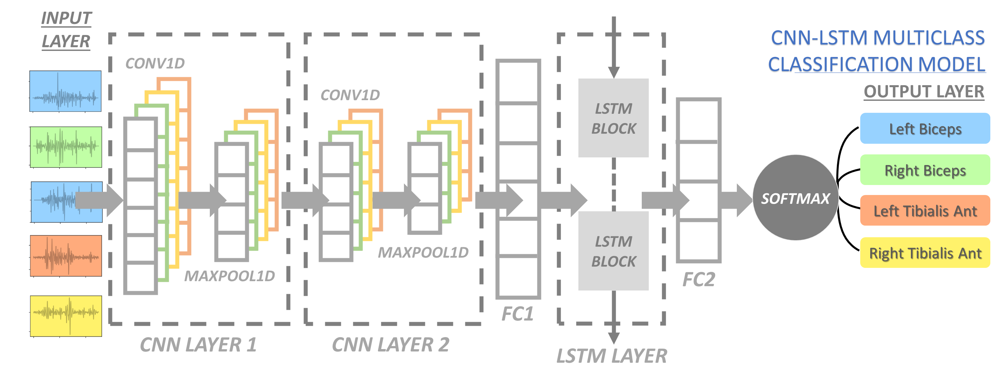
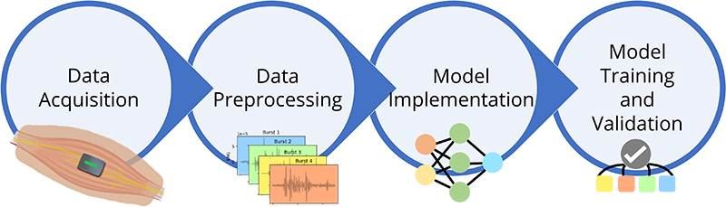
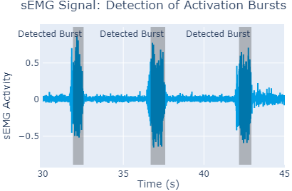
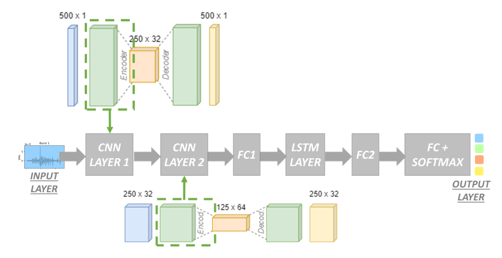
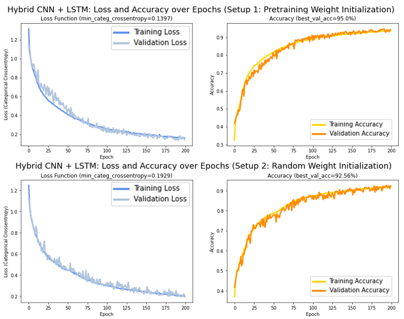
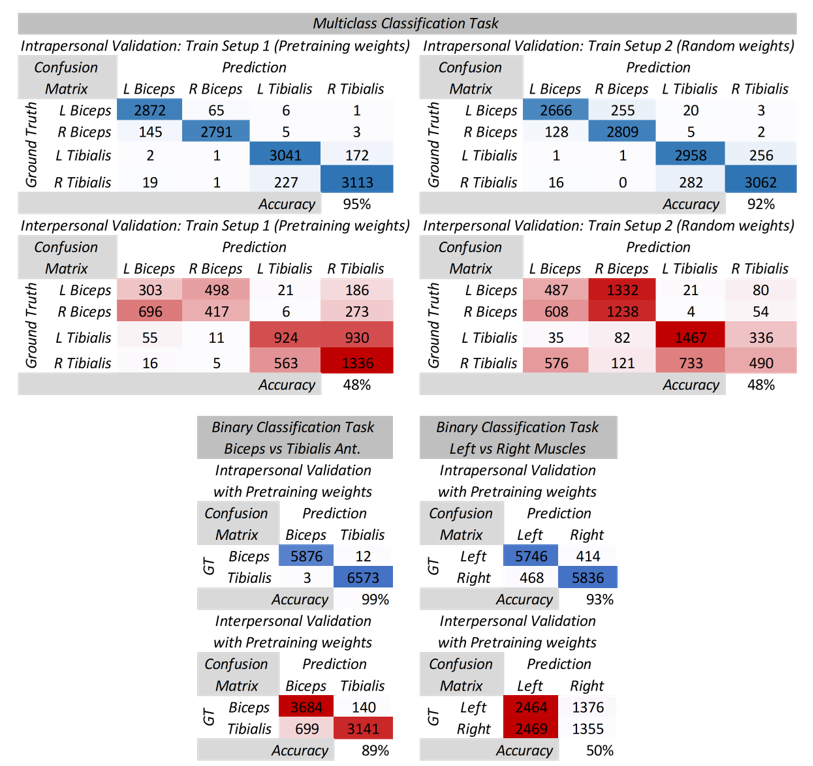

# MUSCLE CLASSIFICATION VIA HYBRID CNN-LSTM ARCHITECTURE AND SEMG SIGNALS

```
Master Thesis and Paper - Vrije Universiteit Brussel
Promotors and Supervisors: Lubos Omelina, Jan Cornelis and Bart Jansen
Program: Msc. Applied Computer Science
Student: Esteban Velásquez Rendón
Academic Year: 2022
```
The current repository contains the code employed for the master thesis in Applied Computer Science. The thesis attained a ranking within the upper quintile of scores of the VUB faculty (top 20%), and the results were also disseminated through a presentation and a [paper](https://ieeexplore.ieee.org/abstract/document/10167918) at the esteemed 24th International Conference on Digital Signal Processing (DSP 2023), sponsored by the IEEE Signal Processing Society and EURASIP. Part of the research is presented in this README file.

The architecture proposed for the deep learning model in this study is presented below:



## Abstract:

Correct traceability of muscle identity within a predefined set of muscles in EMG studies is relevant in the periodic evaluation process of muscle training programs (for athletes), and in routine reviews for muscle rehabilitation. This article proposes hybrid deep learning CNN-LSTM models to classify the muscle directly from sEMG signals. These models allow for effective feature extraction and learning of short-term and long-term sequential dependencies. Two training setups are proposed: one using weight initialization provided from layer-wise unsupervised pretraining and another one using random initialization. Two validation scenarios are described to assess performance: testing on new contraction bursts from already-seen subjects in the training step (intrapersonal validation, useful in follow-up), and testing on a leave-one-out subject (interpersonal validation). Results indicate that the model can correctly classify different muscle groups in patients that already have been screened, but fails in distinguishing between symmetrical muscles.

## Pipeline

This study proposes the use of sEMG to record electrical activity over different muscles of interest with the goal of capturing a series of contraction bursts, from where a hybrid deep learning model is trained with the purpose of inferring on which muscle the sEMG sensor is located. To achieve this goal, the pipeline in the figure below is proposed.



### -Data Acquisition:

sEMG recordings of contraction bursts from different muscles are required to train and validate the model. For this purpose, Trigno Maize Sensor from the company Delsys is proposed and employed for this study. The selected sensor for this study was the Trigno Maize (dry electrode) grid sensor as it senses 16 different channels where the individual electrodes are organized in a $4\times4$ grid with approximately 5mm spacing. The sensor allows wireless data collection from all 16 electrodes in real-time  with a sampling rate of 1000 Hz.

Concerning the experimental setup, 9 healthy volunteers participated in the study in Belgium: 5 men and 4 women ranging from 25 to 71 years old. None of the participants had any clinical history of neuromuscular disorders that could potentially affect the study. The steps proposed in the protocol as well as the possible risks related to the tests were given to the volunteers. The participants were allowed to stop/leave the session in case of any discomfort. The data were collected in a single session where 4 muscles were considered for the study: left and right biceps, as well as left and right tibialis anterior, whereby each recording involved a series of concentric and eccentric muscle contractions for each of these muscles. The 16 channel sensor was placed close to the muscle’s centroid by considering specific anatomical landmarks and proportional distances from them (provided in a detailed protocol). The volunteers where asked to contract the muscle (concentric contraction) and hold the contraction for around 1 second, then release and go back to relaxed state (eccentric contraction) and repeat that every 5 seconds for a total duration of 10 minutes per muscle. This resulted into approximately 120 muscle contractions per muscle for each recording.

### -Data Preprocessing:

The acquired sEMG signals come already prefiltered and normalized by the Delsys acquisition system: a high pass filter (2-pole Butterworth) and low pass filter (8-pole Butterworth). Some other prefiltering considerations applied to the sEMG signals were also applied and are explained in more detail in the Delsys sEMG Detection and Recording manual.

In order to identify the contraction bursts in the sEMG recordings, the beginning and end of each phase of each muscle activation is determined by a single threshold algorithm that makes use of the Teager Kaiser Energy Operator (TKEO), which suppresses the noise and makes the signal larger; thus, making the bursts more easily identifiable.



### -Model Implementation:

As can be concluded from the state-of-the-art analysis, sEMG signal processing is nowadays being approached by hybrid deep learning techniques with better results compared to more traditional machine learning techniques. The models with higher performance normally involved the use of CNN and LSTM for tasks such as gesture recognition and wrist kinematics estimation. Based on this, a hybrid CNN-LSTM is proposed in the current paper as the architecture to address the muscle classification task. The proposed model is composed of CNN, LSTM and FC layers, taking advantage of CNN layers as feature extractors and the LSTM layer to maintain long-term dependencies that are inherent in sEMG signals. See model architecture in the first picture of this README file.

The dataset distribution for the training and validation of the model contemplates two validation scenarios: In the first one, contraction bursts from eight subjects are used in the training of the model (80\% of samples) and later the model is validated (20\% of samples) on new contraction bursts from previously seen participants in the training step (intrapersonal validation). In the second validation scenario, the ninth subject (leave-one-out) is used to assess the model's ability to correctly classify new contraction bursts from unseen participants in the training step (interpersonal validation); this second validation scenario was repeated with different leave-one-out subjects, leading to similar results in all of them. Note that the collected dataset was obtained from a single session.

### -Model Training and Validation:

Due to lack of publicly available pretrained models processing the sEMG signal, it was decided to use autoencoders (AE) to obtain optimal initialization weights for part of the designed network. A Greedy layer-by-layer unsupervised pre-training strategy is proposed to obtain the weight initialization of the two CNN layers. This method is known to provide great generalization properties and to overcome problems of local optimization during the training phase. In this vein, AE architectures are built to implement a reconstruction task for each of the CNN layers, meaning that each of these layers is isolated and used in the encoder part of its own specific AE for recontsruction. An encoder-decoder architecture is thus put in place, where the encoder is driven by the CNN layer, while the decoder is attached in form of a deconvolution operation that allows reconstructing the input tensor from the latent representation. The parameters learned by the encoder part from both CNN layers are posteriorly transferred and used in the final model as illustrated in the figure below.



## Results

Two training setups are presented here: A first one using the weight initialization provided from the layer-wise unsupervised pretraining step and the second one that only uses random weight initialization. After training the model for 200 epochs, the model was able to achieve 95.0\% (setup 1) and 92.56\% (setup 2) classification accuracy in the validation dataset (intrapersonal scenario), where new contraction bursts from already seen subjects where given to the model for the validation purposes. Concerning the second proposed validation scenario (interpersonal scenario or leave-one-out), the model achieved 48\% accuracy (in both setups) for muscle classification of contraction bursts from an excluded subject in the training. The evolution of the loss, as well as the validation accuracy over the epochs is presented in the following picture. 




Something interesting that can be seen from the confusion matrices in the figure below is that when there is a misclassification in the interpersonal validation, it is often between symmetrical muscles, meaning for instance that left biceps is more likely to be misclassified as right biceps and viceversa (also for left and right tibialis anterior). This behaviour ends up heavily penalizing the overall accuracy of the model in this second validation scenario and it is confirmed by performing two additional tests in which the multiclass classification problem is reduced to a binary classification problem (biceps vs tibialis anterior, and left muscles vs right muscles). Further follow-up recordings would be essential in future studies to determine the intersession performance of the model.



## Conclusions

The goal of this article is to investigate the possibility of classifying the underlying muscles directly from the sEMG signal. This is motivated by the fact that the correct traceability of the implicated muscles in EMG studies is relevant in the periodic evaluation process that is carried out for instance in muscle training program effectiveness for athletes, as well as in routine reviews for muscle rehabilitation.

The proposed hybrid CNN-LSTM model was validated in two scenarios: in the first one, the model is tested on new contraction bursts from already seen subjects in the training step, where at least 9 out of 10 times the muscle category was accurately inferred (in both training setups). On the other hand, in the leave-one-out validation scenario, the model could barely classify correctly half of the times, as it seems incapable of distinguishing between symmetrical muscles. 
When constraining the task to a binary classification problem of biceps vs tibialis anterior, the model is able to classify these non-symmetrical muscles almost nine out of ten times (89\% accuracy). On the other hand, when switching the binary classification task to left muscles vs right muscles, the model only achieves 50\% classification accuracy. From our feasibility study we conclude that muscle category can be estimated, but not the lateral side as most of the muscles are mirrored.
